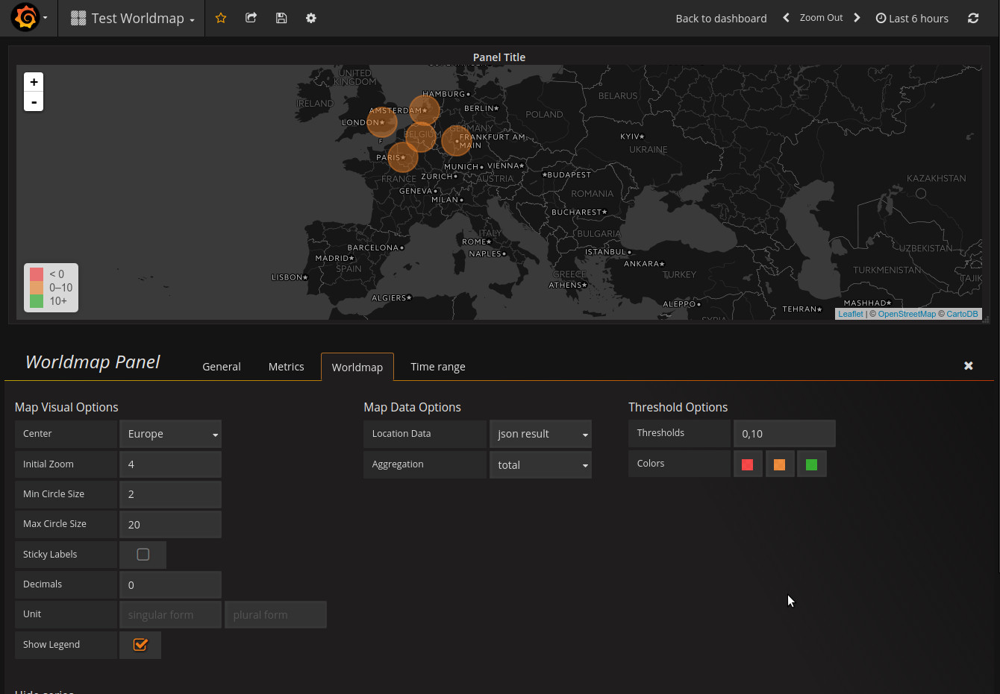

## Grafana - Warp 10 Datasource Plugin

This is a plugin that allows Grafana 4 to support Warp 10 as datasource.

Grafana 3 plugin is in [`grafana-3`](https://github.com/cityzendata/grafana-warp10/tree/grafana-3) branch, Grafana 2.6 plugin in [`grafana-2.6`](https://github.com/cityzendata/grafana-warp10/tree/grafana-2.6).


### Installation:

Copy the content of the folder `dist` to a folder `warp10` inside the folder for plugins in Grafana 3.
In most cases,  this path is located at `[GRAFANA_INSTALL_DIR]/data/plugins`.


### Use

It works more or less like any other Grafana datasource.

Grafana will push to the plugin the `start` and `end` values of the graph.
The plugin will push those values onto the WarpScript stack some variables you can use on your Warpscript scripts:

* `$start` and `$end`, corresponding to the `start` and `end` values of the graph in microseconds
* `$startISO` and `$endISO`, corresponding to the `start` and `end` values in the graph as ISO date format
(useful for the FETCH function, for example)
* `$interval`, corresponding to `$end - $start`


Then you can use these variables in your WarpScript script, for example
for a FETCH.

Examples of WarpScript scripts:

1. Generated sinusoids


        NEWGTS  
        'com.cityzendata.grafana.testmetric' RENAME
        'func' 'sinus' 2 ->MAP RELABEL  
        'sinus' STORE  

        NEWGTS  
        'com.cityzendata.grafana.testmetric' RENAME
        'func' 'cosinus' 2 ->MAP RELABEL  
        'cosinus' STORE  


        $end $start - 'interval' STORE
        $interval 20 / TOLONG 'step' STORE  

        <% $step + %> 'stepMacro' STORE
        <% 'index' STORE $sinus $index NaN NaN NaN $index SIN  ADDVALUE DROP %> 'execMacroSinus' STORE
        <% 'index' STORE $cosinus $index NaN NaN NaN $index COS  ADDVALUE DROP %> 'execMacroCoinus' STORE  

        $start $end $stepMacro $execMacroSinus FORSTEP
        $start $end $stepMacro $execMacroCoinus FORSTEP
        $sinus $cosinus 2 ->LIST  


1. Classic FETCH query


        'YOUR_TOKEN_HERE'
        'classname'
        'labelKey' 'labelValue' ->MAP
        $startISO $endISO
        FETCH

  or  


          'YOUR_TOKEN_HERE'
          'classname'
          'labelKey' 'labelValue' ->MAP
          $end $interval
          FETCH  


### Worldmap integration

You can use `grafana-warp10-datasource` as datasource for showing position data on grafana using `grafana-worldmap-panel` plugin.

In order to do it, you need to install a modified version of the `grafana-worldmap-panel` plugin: [LostInBrittany/worldmap-panel](https://github.com/LostInBrittany/worldmap-panel).

> A [pull request](https://github.com/grafana/worldmap-panel/pull/104) has been submitted to `grafana-worldmap-panel` in order to 
add the changes to the official version of the plugin.

When both `grafana-warp10-datasource` and the modified `grafana-worldmap-panel` installed, you can define a new Wordmap widget,
with a Warp&nbsp;10 datasource and `json result` as *Location Data* in the *Worlmap* tab:


Now in your WarpScript you can generate data in the JSON format supported by Worldmap, for example :

```
'[ { "key": "amsterdam", "latitude": 52.3702, "longitude": 4.8952, "name": "Amsterdam" }, { "key": "charleroi", "latitude": 50.4108, "longitude": 4.4446, "name": "Charleroi" }, { "key": "frankfurt", "latitude": 50.110924, "longitude": 8.682127, "name": "Frankfurt" }, { "key": "london", "latitude": 51.503399, "longitude": -0.119519, "name": "London" }, { "key": "paris", "latitude": 48.864716, "longitude": 2.349014, "name": "Paris" } ]'
JSON->
```

And then you can see the chosen locations in the map:



You can also give a `value` to each location, in order to show the locations with different sizes and colors, as Worldmap allows:

```
'[ { "key": "amsterdam", "latitude": 52.3702, "longitude": 4.8952, "name": "Amsterdam", "value": 9 }, { "key": "charleroi", "latitude": 50.4108, "longitude": 4.4446, "name": "Charleroi", "value": 6 }, { "key": "frankfurt", "latitude": 50.110924, "longitude": 8.682127, "name": "Frankfurt", "value": 9 }, { "key": "london", "latitude": 51.503399, "longitude": -0.119519, "name": "London", "value": 12 }, { "key": "paris", "latitude": 48.864716, "longitude": 2.349014, "name": "Paris", "value": 15 } ]'
JSON->
```


### TODO


* UI redesign for query editor
* Click-by-click FETCH and BUCKETIZE
* Almost no testing has been done yet, except for metrics support.
* Missing support for Annotations


### License


Copyright &copy; 2016 Cityzen Data

APACHE LICENSE Version 2.0, January 2004
