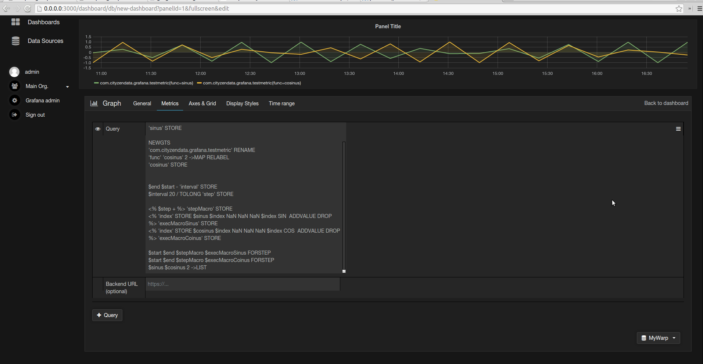

Grafana - Warp 10 Datasource Plugin
======================================

This is a plugin that allows Grafana 4 to support Warp 10 as datasource.

Grafana 3 plugin is in [`grafana-3`](https://github.com/cityzendata/grafana-warp10/tree/grafana-3) branch, Grafana 2.6 plugin in [`grafana-2.6`](https://github.com/cityzendata/grafana-warp10/tree/grafana-2.6).

Installation:
=============

Copy the content of the folder `dist` to a folder `warp10` inside the folder for plugins in Grafana 3.
In most cases,  this path is located at `[GRAFANA_INSTALL_DIR]/data/plugins`.

Use
===

It works more or less like any other Grafana datasource.

Grafana will push to the plugin the `start` and `end` values of the graph.
The plugin will push those values onto the WarpScript stack some variables you can use on your Warpscript scripts:

* `$start` and `$end`, corresponding to the `start` and `end` values of the graph in microseconds
* `$startISO` and `$endISO`, corresponding to the `start` and `end` values in the graph as ISO date format
(useful for the FETCH function, for example)
* `$interval`, corresponding to `$end - $start`

Then you can use these variables in your WarpScript script, for example
for a FETCH.

Examples of WarpScript scripts:

1. Generated sinusoids

        NEWGTS  
        'com.cityzendata.grafana.testmetric' RENAME
        'func' 'sinus' 2 ->MAP RELABEL  
        'sinus' STORE  

        NEWGTS  
        'com.cityzendata.grafana.testmetric' RENAME
        'func' 'cosinus' 2 ->MAP RELABEL  
        'cosinus' STORE  

        $end $start - 'interval' STORE
        $interval 20 / TOLONG 'step' STORE  

        <% $step + %> 'stepMacro' STORE
        <% 'index' STORE $sinus $index NaN NaN NaN $index SIN  ADDVALUE DROP %> 'execMacroSinus' STORE
        <% 'index' STORE $cosinus $index NaN NaN NaN $index COS  ADDVALUE DROP %> 'execMacroCoinus' STORE  

        $start $end $stepMacro $execMacroSinus FORSTEP
        $start $end $stepMacro $execMacroCoinus FORSTEP
        $sinus $cosinus 2 ->LIST  

1. Classic FETCH query

        'YOUR_TOKEN_HERE'
        'classname'
        'labelKey' 'labelValue' ->MAP
        $startISO $endISO
        FETCH

  or  

          'YOUR_TOKEN_HERE'
          'classname'
          'labelKey' 'labelValue' ->MAP
          $end $interval
          FETCH  

TODO
====

* UI redesign for query editor
* Click-by-click FETCH and BUCKETIZE
* Almost no testing has been done yet, except for metrics support.
* Missing support for Annotations

License
=======

Copyright &copy; 2016 Cityzen Data

APACHE LICENSE Version 2.0, January 2004
